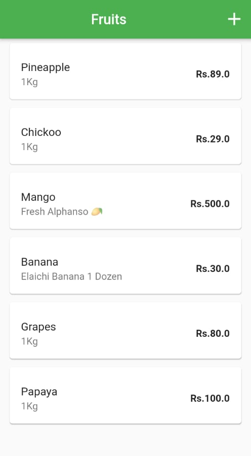
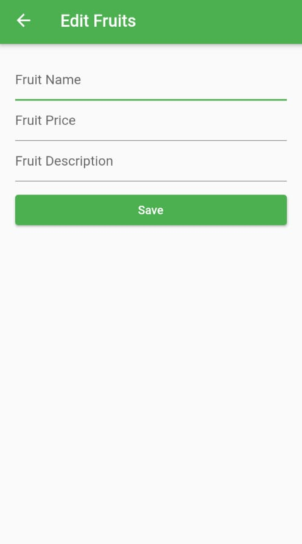
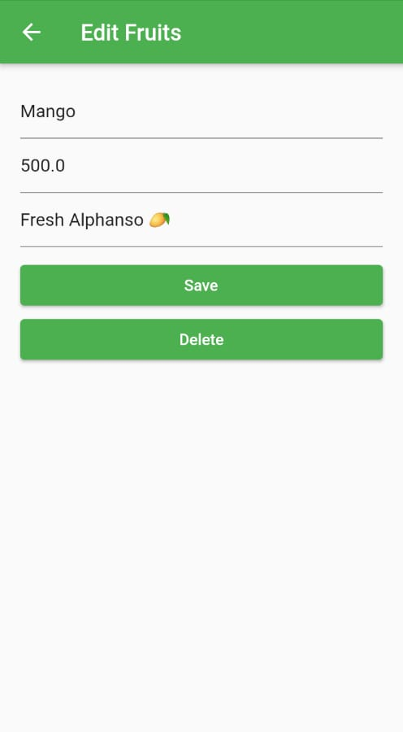

# FruitStore
Flutter App with FireBase as Backend. Database used is FireStore.

Fetches Realtime data from FireStore and Displays in the Home screen.

# Features:
Create and Add Name, Price and Description of a Fruit

Delete an existing record.

Update any attributes of a record.

# ScreenShots
      
